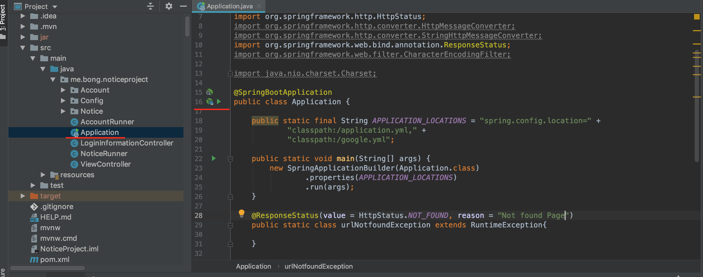
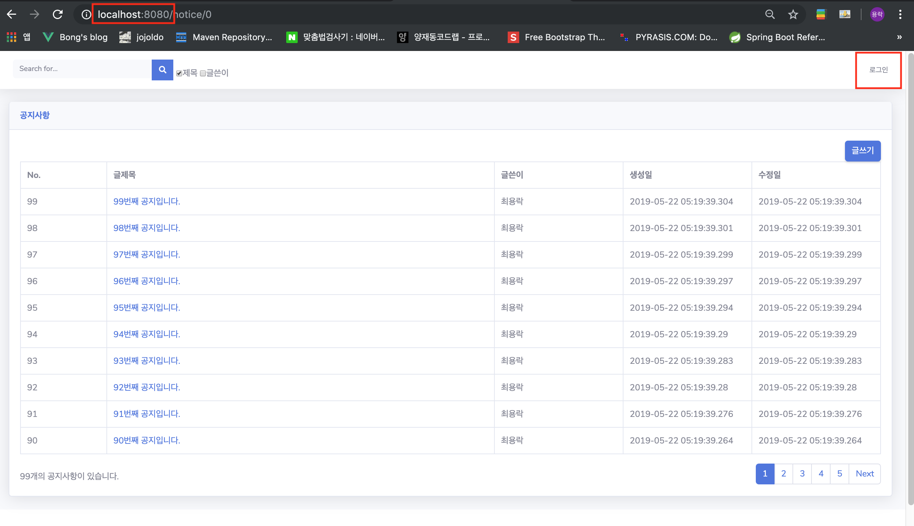
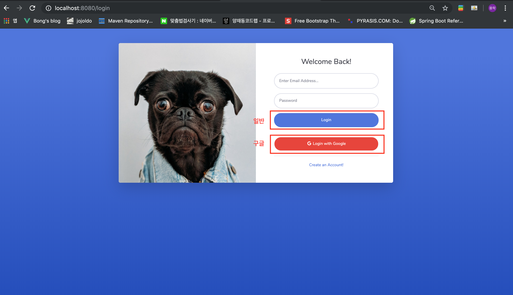
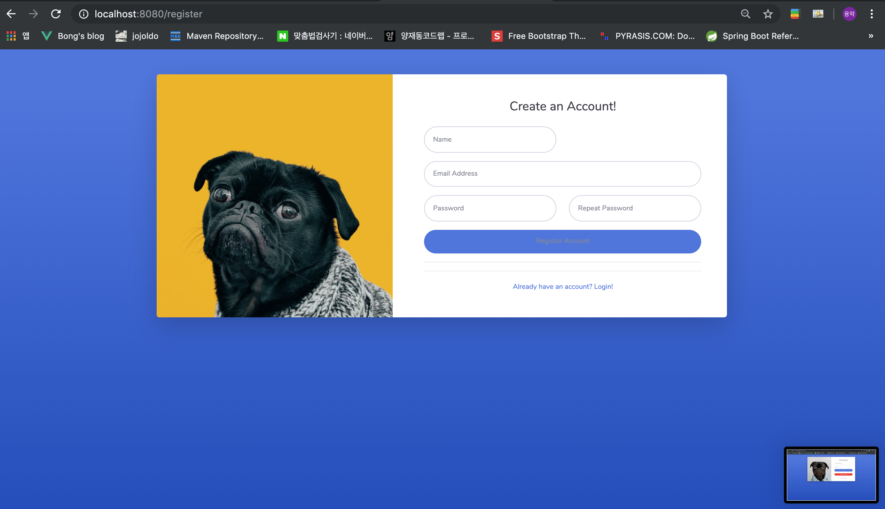
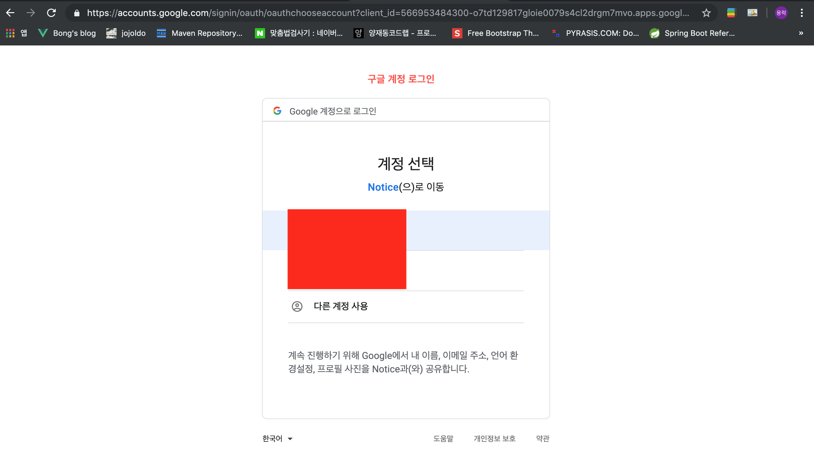
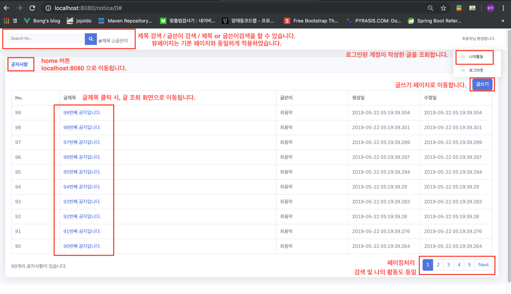
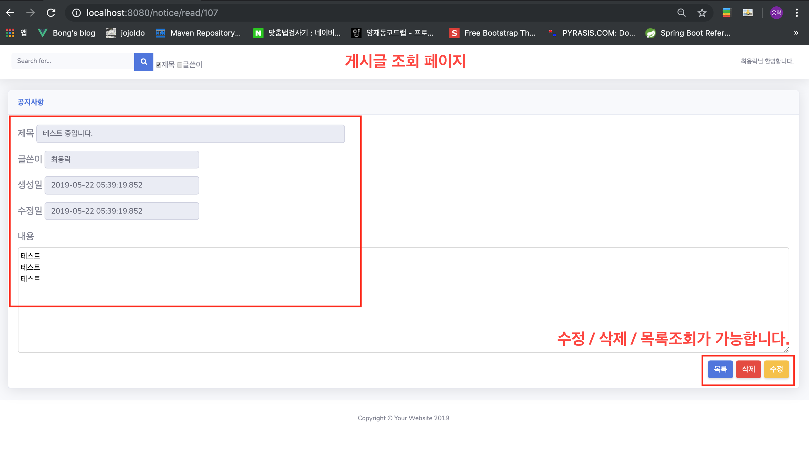
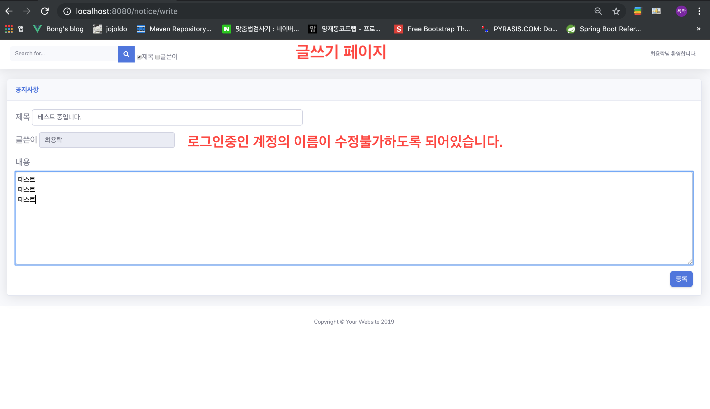

## 공지사항 웹 어플리케이션 구현

### 사용스택
- Java
- Spring(Boot)
- jQuery
- DB - h2(embedded DB)
- JPA
- SpringSecurity
- Oauth2(구글 로그인)
- 템플릿 엔진 - thymeleaf
- 디자인 - 부트스트랩 템플릿 활용
- maven

### 프로젝트 빌드 및 실행방법
- zip파일 다운 또는 clone 후에 아래와 같은 방법으로 실행합니다.
    1. IDE툴 사용하여 Application.class 실행
        

    2. jar 파일로 실행
        - 메이블 플러그인을 통해 jar파일 생성 
            - clone 또는 압축푼 폴더의 위치를 찾아 아래 명령어 입력  
            - mvn clean
                - target아래 파일들 삭제
            - mvn package -DskipTests
                - test제외하고 실행 target아래 jar파일 하나를 생성한다.

        - 실행
            - java -jar (target아래 생성된 .jar파일명)

- 접속url : http://localhost:8080 ([http://localhost:8080/notice/0](http://localhost:8080/notice/0) 로 이동됩니다.)
        
### 기능 구현
- 메인화면, 로그인, 회원가입페이지를 제외하고 모두 로그인 되어야 서비스 이용이 가능하다.(로그인 되어있지 않을 시, 로그인 페이지로 이동된다.)

- 구글 로그인이 가능하다.
- 일반 회원가입 및 로그인이 가능하다.
- 사용자는 텍스트로 된 공지를 추가할 수 있다.
- 사용자는 공지를 수정/삭제할 수 있다.
- 사용자는 공지목록을 조회할 수 있다.
- 조회시 제목, 작성일, 작성자, 최종수정일, 내용이 조회 가능하다.
- 목록은 페이징 기능이 있다.
- 제목/글쓴이로 검색이 가능하다.

### 구현결과

